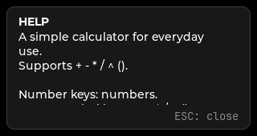

# Calculator

A simple CardputerZero calculator built with LVGL.

## Features

- iOS-style display: the gray source formula appears above the active result/input line.
- Direct numeric keys; `sym` combinations provide `. + - * / ^ ( )`.
- `OK`/`=` evaluates, Backspace deletes one character.
- Unsupported printable symbols are ignored.
- Division by zero and malformed expressions show `error`.
- After an evaluation, operators append to the result; digits start a new calculation.
- Black background, right-aligned white main line, gray source line, slow scrolling when long.
- JetBrains Mono at 24 px for the main line and 20 px for the source line.

## Screenshots

| Input | Result |
| --- | --- |
|  |  |
| **Continued calculation** | **Help** |
|  |  |

## Build

Run `scons` in this directory. The host defaults to the LVGL SDL backend; the
device build enables the Linux framebuffer/evdev backends.

Select a configuration with `CONFIG_DEFAULT_FILE`:

| Configuration | Build host | Output target |
| --- | --- | --- |
| `linux_x86_sdl2_config_defaults.mk` | Linux x86_64 | Linux x86_64 SDL2 application |
| `linux_x86_cross_cp0_config_defaults.mk` | Linux x86_64 | CardputerZero Linux ARM64 application |
| `mac_cross_cp0_config_defaults.mk` | macOS | CardputerZero Linux ARM64 application |

For a Linux SDL2 build (requires SDL2 development headers and libraries):

```bash
export CONFIG_DEFAULT_FILE=linux_x86_sdl2_config_defaults.mk
scons -Q
```

For a macOS cross-build, install the toolchain and ensure its binaries are on `PATH`:

```bash
brew tap messense/macos-cross-toolchains
brew install aarch64-unknown-linux-gnu
export CONFIG_DEFAULT_FILE=mac_cross_cp0_config_defaults.mk
scons -Q
```

## Cross-build and deploy

```bash
export CONFIG_DEFAULT_FILE=linux_x86_cross_cp0_config_defaults.mk
CONFIG_REPO_AUTOMATION=1 scons -Q
./scripts/deploy.sh pi@192.168.199.179
```

The deploy script backs up any existing target files under a timestamped
directory in `/usr/share/APPLaunch/backups`, installs the binary, desktop
entry, and icon, restarts APPLaunch, and verifies service state plus checksum.

## On-device checks

1. Confirm the Calculator entry and icon in APPLaunch.
2. Start it and type `1+2`; press `OK`, then continue with `*2`.
3. Check `1/0` displays `error`, and Backspace removes one character.
4. Enter a sufficiently long expression and verify both display rows scroll slowly.

## Tests

```bash
c++ -std=c++17 -I tests/include -I main/include \
  tests/calculator_ui_state_test.cpp main/src/calculator_engine.cpp \
  -o /tmp/calculator_ui_state_test
/tmp/calculator_ui_state_test
```

tests/calculator_engine_test.cpp covers parser precedence and error handling.
